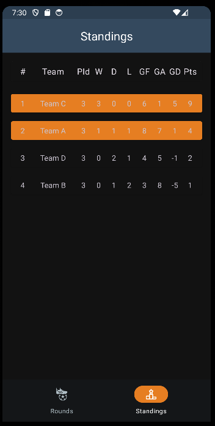

# SoccerSim

SoccerSim is an sample Android application that simulates a soccer tournament group stage. It allows users to generate matches, simulate results, and view standings of teams.
App consists of two screens - rounds and standings 

## Rounds
Rounds screen consists of graphical representation of three rounds played on a group stage, where we can see matches with teams and the score of a match.
There's a FAB to simulate matches (or update them with new simulation results)

## Standings
Standings screen consists of a table that shows statistics of each team: position in group, team name, matches played, matches won, matches lost, matches drawn, goals for, goals against, goals diff, and points
First two teams who win a group stage should advance further which is shown by a different color.

### Thoughts
Throughout this project, I developed the sample app as efficiently as possible within the given timeframe. While many planned features, such as sorting for the standings table by fields, landscape mode, adaptive layouts etc. had to be set aside due to time constraints, I focused on delivering a robust core functionality.

Due to the same reason my codebase may prompt some questions regarding the relationships between data, and I acknowledge that the test coverage is not exhaustive, primarily covering the base functionality while omitting many corner cases.

Despite these limitations, I hope this assignment showcases my capabilities as a developer and provides insight into my problem-solving approach and technical proficiency. I am confident in my ability to contribute effectively, and I am always eager to learn and enhance my skills further.

### Note
I developed and tested on Pixel 3a device which is in the medium-sized screen range and represents a significant portion of the market. Designing for this size should cover the majority of users.

APK file is located in assets folder